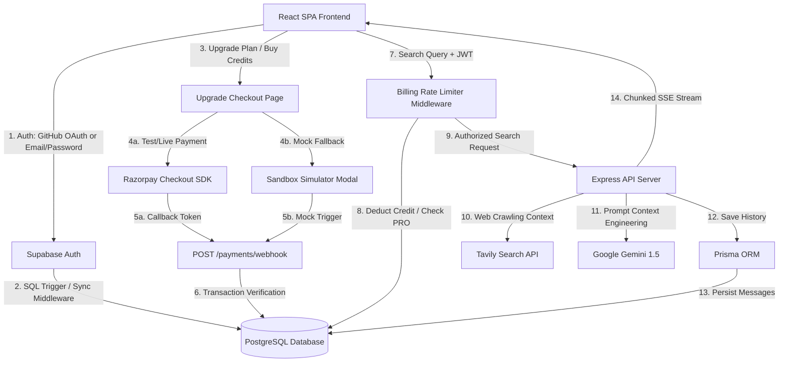
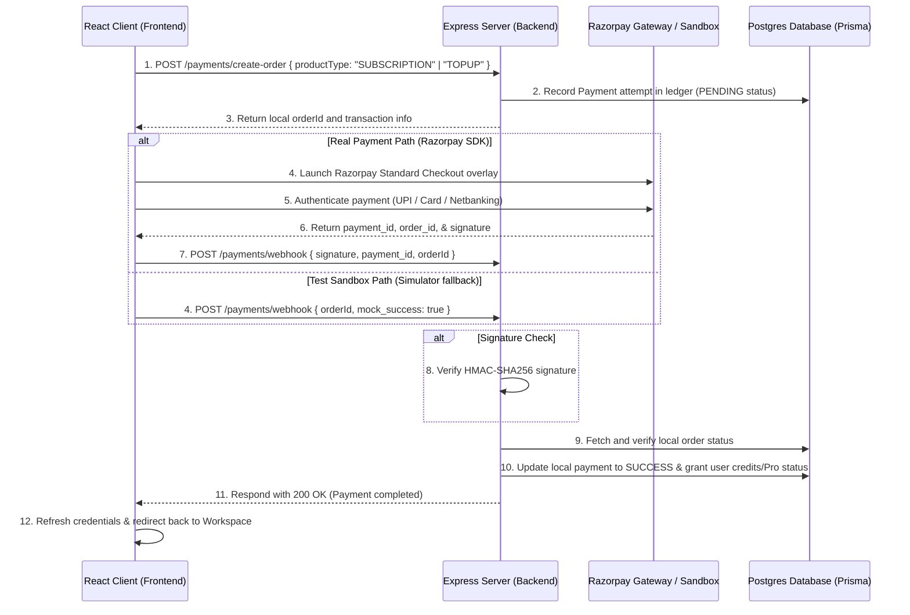
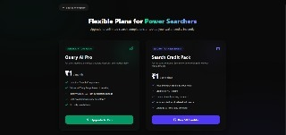
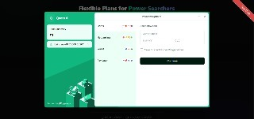
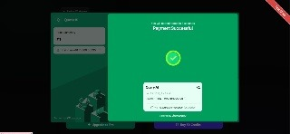

# Query AI 🚀
### The Next-Generation Synthesized AI Search Engine

> [!TIP]
> **Live Production Deployments:**
> - **Frontend Site (Render):** [https://query-ai-1.onrender.com](https://query-ai-1.onrender.com)
> - **Backend API Server (Render):** [https://query-ai-gwj8.onrender.com](https://query-ai-gwj8.onrender.com)
> - **Database & Auth Integration:** Hosted PostgreSQL & GitHub OAuth + Credentials via Supabase

Query AI is a high-fidelity, premium dark-mode Perplexity clone built using the **Bun runtime**, **React**, **Express**, **Prisma ORM**, and **Google Gemini LLM**. It delivers a real-time, cited search experience that crawls the web, aggregates reliable sources, structures answers in markdown grids, and suggests context-aware follow-up questions.

---

## 🏗️ System Architecture

Query AI is architected with a decoupled frontend and backend, using **Supabase** for user authentication and user profile database synchronization.

### 🗺️ Component Relationships


### Key Technical Pillars:
1. **Frontend App**: Responsive React SPA styled with Tailwind CSS, utilizing Radix-UI components and Lucide icons for micro-interactions and transitions.
2. **Backend Engine**: Express server running on the ultra-fast Bun runtime. It handles authentication middleware, query history caching, Tavily web searching, and server-sent stream completions.
3. **Database Layer**: PostgreSQL managed via Supabase. Schema migrations and database interactions are performed using the Prisma v7 ORM.

---

## 💳 Payment Orchestration Flow (Razorpay & Sandbox Webhooks)

Query AI integrates a hybrid monetization flow that allows users to purchase subscriptions (Query AI Pro) or pay-as-you-go refills (Search Credits). The system handles off-site gateway completions asynchronously using a cryptographically verified webhook channel.



---

## 🌟 Key Features

* **Instant Web Synthesis**: Crawls the web dynamically using the Tavily Search API and structures answers using Vercel AI SDK and Google Gemini (`gemini-1.5-flash`).
* **Interactive Workspace Tabs**:
  * **Answer**: Displays real-time streaming completions formatted in clean Markdown, citations, tables, and related questions.
  * **Links**: Renders a clean, deduplicated grid of every single domain reference crawled during the active thread session.
* **Hybrid Monetization (Subscriptions vs. Credits)**: Let users purchase `Query AI Pro` subscriptions (unlimited searches) or top up usage credits in their wallets (`+50` search credits packages).
* **Pre-flight Billing Rate Limiter**: Express check middleware intercepting search queries, dynamically decrementing active credits or letting PRO users pass, preventing API cost overrun.
* **Secure Cryptographic Webhook Handler**: Asynchronous verification using HMAC-SHA256 signatures, ensuring user upgrades happen only after off-site gateway success events.
* **Self-Healing Account Integration**: Auth syncing that merges Supabase ID changes if email credentials and OAuth methods collide.
* **Smart XML-Like Response Parser**: Automatically decodes and parses `` `<ANSWER>` `` and `` `<FOLLOW_UPS>` `` suggestions in real-time, allowing users to click follow-up questions to query further in history context.
* **OAuth Security**: User registration, login, and sessions are securely managed via Supabase GitHub OAuth.
* **Secure JWT Middleware**: Private backend routes require a valid Supabase JWT in the `Authorization` header. The middleware lazily syncs verified users into the Postgres database, preventing constraint collisions.
* **Side-Docked Navigation**: Fast access to conversation histories (loaded via `GET /conversations`) with individual item deletion support (`DELETE /conversation/:id`).
* **Dedicated Account Page**: An elegant `/profile` interface displaying user credentials, avatar initials, and logout options.

---

## 🛠️ Local Installation & Setup

Ensure you have the [Bun runtime](https://bun.sh/) installed on your machine.

### 1. Configure & Run Backend
Navigate to the `Backend` directory and install dependencies:
```bash
cd Backend
bun install
```
Create a `.env` file based on `.env.example` and fill out the required variables:
```env
DATABASE_URL="postgresql://..." # Your PostgreSQL Database URL
DIRECT_URL="postgresql://..."   # Direct connection URL (for migrations)
SUPABASE_URL="https://your-project.supabase.co"
SUPABASE_SECRET_KEY="your-supabase-service-role-key"
GEMINI_API_KEY="your-google-gemini-key"
TAVILY_API_KEY="your-tavily-search-key"
GITHUB_OAUTH_CLIENT_ID="your-github-client-id"
GITHUB_OAUTH_SECRET="your-github-client-secret"
VITE_RAZORPAY_KEY_ID="rzp_test_xxxxxx" # Your Razorpay Test Key ID
```
Start the index server in hot-reload mode:
```bash
bun --hot index.ts
```
The backend API server will listen on **`http://localhost:3000`**.

### 2. Configure & Run Frontend
Navigate to the `Frontend` directory and install dependencies:
```bash
cd ../Frontend
bun install
```
Create a `.env` file based on `.env.example`:
```env
SUPABASE_URL="https://your-project.supabase.co"
SUPABASE_ANON_KEY="your-supabase-anon-key"
VITE_RAZORPAY_KEY_ID="rzp_test_xxxxxx"
```
Start the client development server:
```bash
bun dev
```
Open **`http://localhost:5173`** (or the printed port) in your browser.

> [!NOTE]
> **Dynamic URL Resolution (No Code Changes Needed!):**
> The frontend automatically detects where it is running. If it runs on `localhost` or `127.0.0.1`, it directs API calls to the local backend `http://localhost:3000`. In production, it targets the live Render backend (`https://query-ai-gwj8.onrender.com`). You do not need to change any URLs before pushing to GitHub!

---

### 📦 Verifying the App in Production Mode
For testing how the frontend builds, minifies, and serves assets under production conditions (`NODE_ENV=production`) using Bun's static serving and SPA client fallback logic, see the **[Production Verification Test Script (production/verify_production.ts)](file:///e:/Project%20Completed/Query%20Al/production/verify_production.ts)** (kept local/untracked).
- You can run the production test suite locally using:
  ```bash
  bun run production/verify_production.ts
  ```

---

## ⚡ Database Synchronization Triggers

For production-grade authentication, we configure Postgres database triggers in the Supabase console. This syncs profile additions and removals from `auth.users` directly to the `public.User` schema managed by Prisma:

```sql
-- Trigger Function for User Creation
create or replace function public.handle_new_user()
returns trigger as $$
begin
  insert into public."User" (id, email, name, provider, "supabaseId")
  values (
    gen_random_uuid(),
    new.email,
    coalesce(new.raw_user_meta_data->>'full_name', new.raw_user_meta_data->>'name', split_part(new.email, '@', 1)),
    case when new.raw_app_meta_data->>'provider' = 'google' then 'Google'::"Authprovider" else 'Github'::"Authprovider" end,
    new.id
  );
  return new;
end;
$$ language plpgsql security definer;

-- Bind Trigger
create trigger on_auth_user_created
  after insert on auth.users
  for each row execute procedure public.handle_new_user();
```

---

## 📸 Interface Screenshots

The following screenshots showcase the premium dark-mode interface and rich features of **Query AI**:

### 🔐 1. Authentication (GitHub OAuth / Clean Credentials Sign-In Screen)


### 🏠 2. Landing Dashboard (Sleek Query Input, History Side-Dock, Plan Badge)


### 💬 3. Synthesized Answer (Real-time Citations & Remaining Credits Counter)


### 🔗 4. Reference Links Grid (Deduplicated Source Cards Layout)


### 👤 5. User Account Profile (Avatar Initials & Billing Account Management)


### 💳 6. Checkout Plan Selector (Upgrade plans & Wallet refill cards)


### 🛡️ 7. Razorpay Payment Gateway (Test UPI, cards, and netbanking options)


### 🎉 8. Payment Success (Real-time webhook verified upgrade completion)

